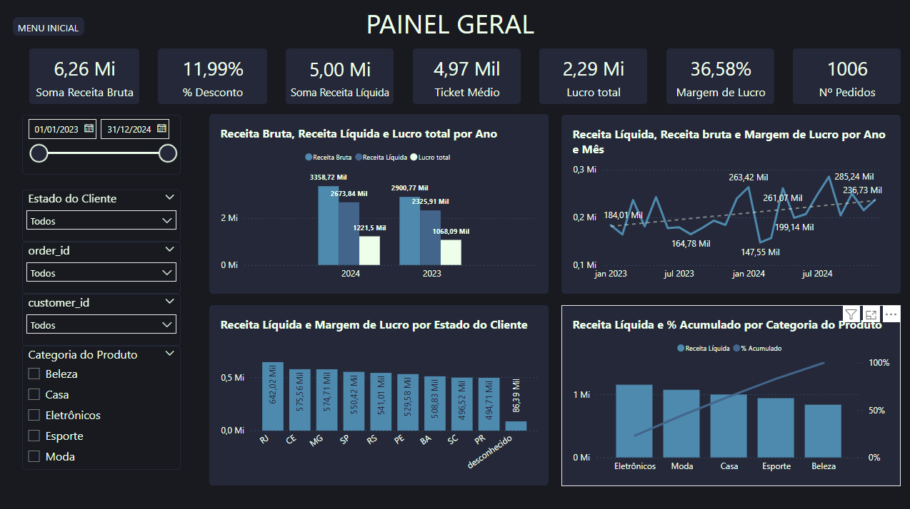
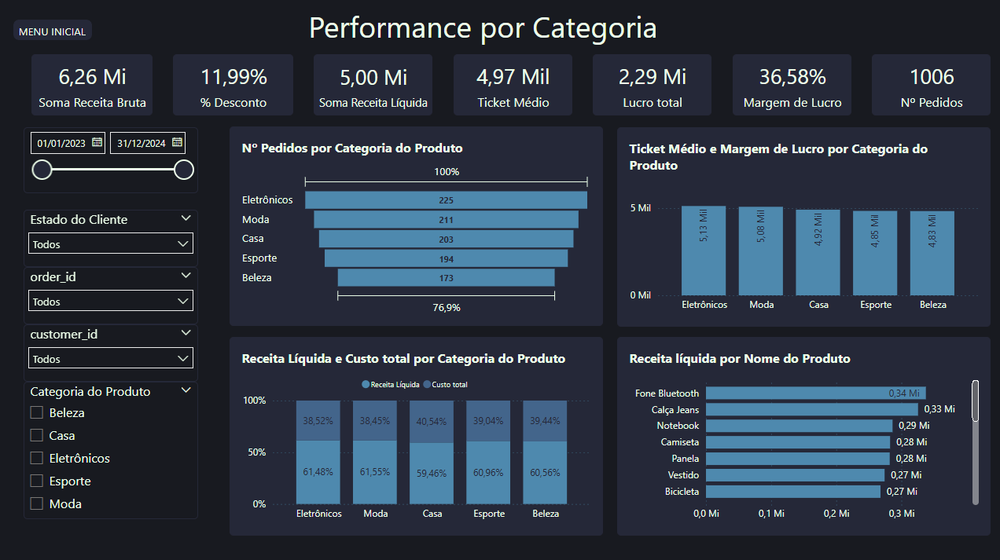
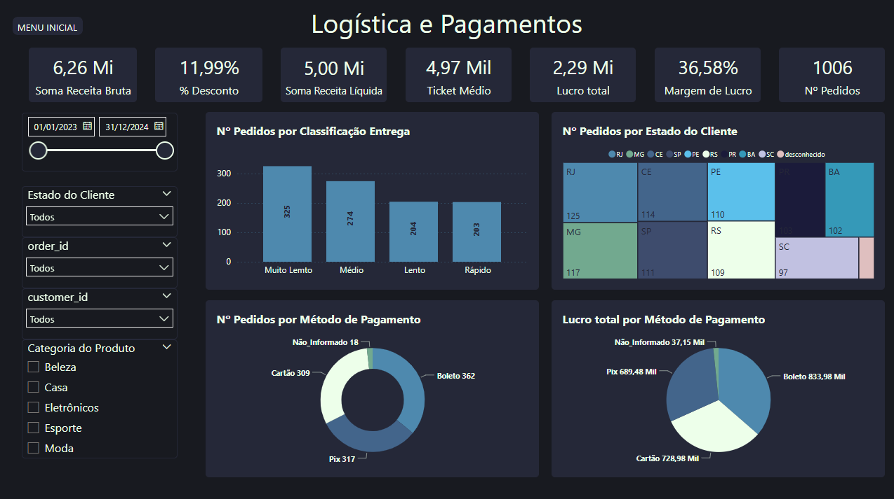
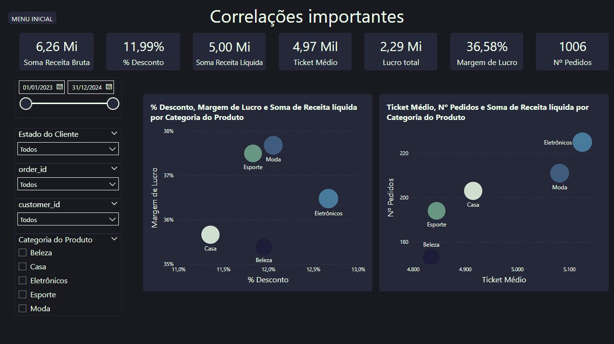
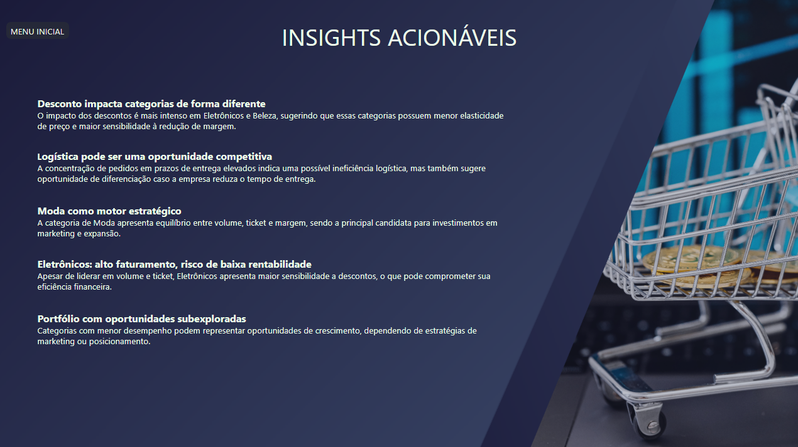

# 📊 Análise de Performance de E-commerce
### Crescimento vs Rentabilidade

> Como identifiquei que uma empresa estava crescendo… mas possivelmente perdendo eficiência financeira.

---

## 🏢 Contexto de Negócio

A **ShopMax** é um e-commerce fictício que atua em todo o Brasil, com foco em cinco categorias principais: Eletrônicos, Moda, Beleza, Casa e Esporte.

A empresa utiliza estratégias de desconto para impulsionar vendas e apresenta forte atuação digital com diferentes métodos de pagamento e logística variável por região.

O objetivo desta análise é entender a performance do negócio sob a ótica de faturamento, lucro, comportamento de categorias e eficiência operacional.

---

## ❓ Problema

Apesar do crescimento em volume de vendas, surgiram dúvidas sobre a sustentabilidade da operação:

- Os descontos estão impactando a rentabilidade?
- O crescimento está sendo eficiente?
- Existem gargalos operacionais que afetam o desempenho?

A análise foi conduzida para responder essas perguntas e identificar oportunidades estratégicas.

---

## 📂 Dataset

O dataset contém mais de **10.000 registros** de pedidos realizados entre 2023 e 2024.

**Principais variáveis analisadas:**
- Receita bruta, líquida e lucro
- Descontos
- Categorias de produtos
- Métodos de pagamento
- Tempo de entrega

**Tratamento realizado antes da análise:**
- Correção de tipos
- Remoção de inconsistências (ex: receita líquida maior que bruta)
- Tratamento de outliers
- Padronização de categorias

---

## 🔍 Processo de Análise

A análise foi estruturada em três etapas principais:

**1. Análise Descritiva**
Avaliação de métricas gerais como faturamento, lucro, ticket médio e volume de pedidos.

**2. Análise de Correlação**
Investigação da relação entre variáveis-chave:
- Desconto vs margem
- Prazo de entrega vs volume
- Ticket médio vs volume por categoria

**3. Análise Estratégica**
Identificação de padrões, problemas centrais e oportunidades de negócio.

---

## 📊 Dashboard

O dashboard foi estruturado em quatro painéis principais:

| Painel | Descrição |
|--------|-----------|
| **Visão Geral** | Principais KPIs: faturamento, lucro, margem e evolução temporal |
| **Performance por Categoria** | Receita, margem e volume por categoria |
| **Logística e Pagamento** | Impacto do tempo de entrega e métodos de pagamento |
| **Correlações** | Relações entre as principais variáveis de negócio |

### Visão Geral

### Performance por Categoria

### Logística e Pagamento

### Correlações

### Painel de Insights

---

## 💡 Principais Insights

- **Descontos** impactam mais fortemente Eletrônicos e Beleza, reduzindo significativamente a margem
- **Moda** apresenta equilíbrio entre volume, ticket médio e margem — sendo a categoria mais eficiente
- **Eletrônicos** possui alto faturamento, mas menor eficiência financeira devido à baixa margem
- A maior parte dos pedidos ocorre com **prazos de entrega elevados**, indicando possível ineficiência logística
- Outras categorias apresentam menor relevância, podendo indicar **oportunidades não exploradas**

---

## 🎯 Proposta Central

> O crescimento da empresa está sendo impulsionado por volume e uso de descontos, porém com impacto negativo na rentabilidade e indícios de ineficiência operacional, especialmente em logística e na gestão por categoria.

---

## ✅ Recomendações

- Reduzir descontos em categorias de baixa margem, como Eletrônicos
- Aumentar investimento em marketing na categoria Moda
- Revisar processos logísticos para reduzir o tempo de entrega
- Avaliar rentabilidade por produto, não apenas por volume
- Incentivar métodos de pagamento mais lucrativos

---

## 🛠️ Ferramentas Utilizadas

- Power BI
- Power Query
- DAX

---

## 🔗 Portfólio Completo

Acesse meu portfólio para ver este e outros projetos:
👉 [biconte.wixsite.com/portf](https://biconte.wixsite.com/portf)

---

*Desenvolvido por **Bianca Conte Lucio***
